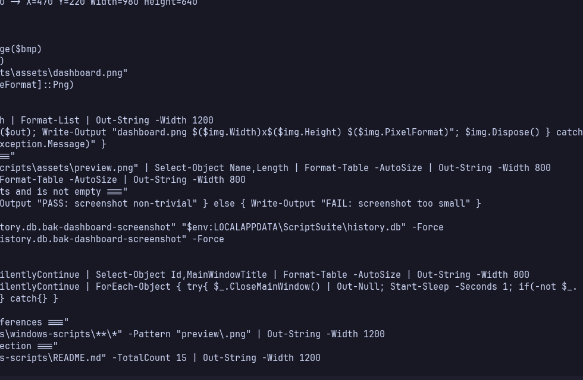
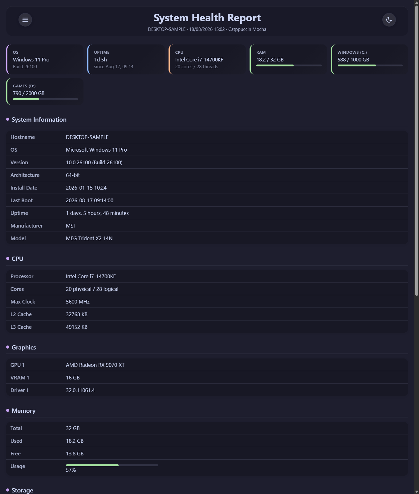

# windows-scripts


[](https://github.com/catppuccin/catppuccin)

A Windows maintenance suite — a WPF dashboard (`ScriptSuite`) over nine self-contained PowerShell scripts for cleanup, system tasks, and diagnostics. For most users it's a normal Windows app (download, unzip, run); for developers the same scripts run directly via PowerShell and the app builds from source.

## Preview



*ScriptSuite dashboard in Mocha dark (966×633) — the Cleanup section shown (5 of 9 script tiles); System and Reports sections continue below. Each tile has run, settings, and hide controls, plus "run all" selection. History and Run All are accessible from the header.*

## Download — for most users (no SDK needed)

**Latest Release:** [`v2.0.0` — `ScriptSuite v2.0.0`](https://github.com/Bllodwolfie/windows-scripts/releases/tag/v2.0.0)

1. Download [`ScriptSuite-win-x64-self-contained.zip`](https://github.com/Bllodwolfie/windows-scripts/releases/download/v2.0.0/ScriptSuite-win-x64-self-contained.zip) (self-contained `win-x64`, no .NET runtime to install).
2. Right-click the zip → `Extract All` → open the folder.
3. Double-click `ScriptSuite.exe`. Optionally run `Install.ps1` from the repo to create a Start Menu shortcut (Windows Search → `ScriptSuite`).

> **First-run SmartScreen:** the exe is unsigned, so Windows SmartScreen / Microsoft Defender SmartScreen may show *Windows protected your PC* → click `More info` → `Run anyway`. The zip comes from GitHub via `Mark of the Web`; extracting with Explorer handles it. No admin needed to run the app itself.

*Requires Windows 10 / 11 (x64). No PowerShell version check — the shipped `scripts\` are bundled with the publish output.*

## Build from source — for developers

**Prerequisite:** [.NET 10 SDK](https://dotnet.microsoft.com/download) (`10.0.x`, `dotnet --version` should print `10.0.400+`). The app builds `ScriptSuite/ScriptSuite.csproj:3` (`net10.0-windows`, `UseWPF`).

```powershell
git clone https://github.com/Bllodwolfie/windows-scripts.git
cd windows-scripts

# Per-user install (no admin): publish self-contained to %LOCALAPPDATA%\Programs\ScriptSuite
# and create %APPDATA%\Microsoft\Windows\Start Menu\Programs\ScriptSuite.lnk
.\Install.ps1

# Later
.\Uninstall.ps1   # removes app + shortcut, keeps %LOCALAPPDATA%\ScriptSuite data (history.db, configs)
```

`Install.ps1` runs `dotnet publish -c Release -r win-x64 --self-contained true -o publish` (`publish` is not committed, `**/bin/`, `**/obj/` are gitignored) and copies to the stable per-user path (`AppPaths.cs:26` data stays at `%LOCALAPPDATA%\ScriptSuite`). Use `-NoBuild` to install from an already-downloaded Release zip, or `-InstallDir` / `-ShortcutPath` to override.

**Run scripts directly (no dashboard):**

```powershell
# If your policy already allows local scripts (RemoteSigned)
.\scripts\SystemHealthReport\SystemHealthReport.ps1

# Fresh Windows (Restricted) — one-off bypass, no permanent change
pwsh -ExecutionPolicy Bypass -File .\scripts\SystemHealthReport\SystemHealthReport.ps1

# From a ZIP download, first unblock
Get-ChildItem .\scripts -Recurse -Filter *.ps1 | Unblock-File
```

## The 9 scripts

Descriptions are verbatim from `ScriptSuite/Manifests/*.json:2` (source of truth for what ships; `v1.0.1` excludes `m12_elevated_test` test scaffolding).

| Script | What it does | Requires admin |
|--------|--------------|----------------|
| [SystemHealthReport](scripts/SystemHealthReport/) | Generates a self-contained HTML report of system health (CPU, memory, disks, network, errors). | No |
| [ClearEventLogs](scripts/ClearEventLogs/) | Backs up and clears all Windows event logs. | **Yes** |
| [DownloadsCleanup](scripts/DownloadsCleanup/) | Sorts and cleans the Downloads folder: deletes old installer/archive files and moves others into matching category folders. Supports Advanced per-extension rules (Ignore/Delete/MoveTo) that override the simple `Extensions to delete` list. | No |
| [EmptyFolderCleanup](scripts/EmptyFolderCleanup/) | Recursively removes empty folders under a chosen root folder. | No |
| [EmptyRecycleBin](scripts/EmptyRecycleBin/) | Permanently empties the Recycle Bin. Deleted files cannot be recovered. Supports “Only delete items older than N days” (0 = everything). | No |
| [RestorePoint](scripts/RestorePoint/) | Creates a System Restore point and verifies it actually appeared. | **Yes** |
| [ScreenshotsCleanup](scripts/ScreenshotsCleanup/) | Deletes old screenshots from the Pictures\Screenshots folder. | No |
| [SoftwareInventory](scripts/SoftwareInventory/) | Generates a text report of all installed software. | No |
| [TempCleanup](scripts/TempCleanup/) | Deletes files from the Windows temp folder that are older than the cutoff. | No |

Defaults live in `ScriptSuite/DefaultConfigs/*.json:1` and copy to `%LOCALAPPDATA%\ScriptSuite\Configs\` on first run (`AppPaths.cs:37` `EnsureConfigsSeeded`, never overwrites existing):

- `ClearEventLogs` → `BackupDir: %USERPROFILE%\Documents\Script_Logs\EventLogBackups`
- `DownloadsCleanup` → `SourceDir: %USERPROFILE%\Downloads`, `CutoffDays: 7`, `LogDir: %USERPROFILE%\Documents\Script_Logs` (+ `DeleteExts` / `Categories`)
- `EmptyFolderCleanup` → `TargetFolder: %USERPROFILE%\Downloads`
- `ScreenshotsCleanup` → `TargetFolder: %USERPROFILE%\Pictures\Screenshots`, `CutoffDays: 7`
- `SoftwareInventory` → `OutputFile: %USERPROFILE%\Documents\Script_Logs\Software_Inventory.txt`
- `SystemHealthReport` → `OutputDir: %USERPROFILE%\Documents`, `OutputFile: System_Health_Report.html`
- `TempCleanup` → `TargetFolder: %TEMP%`, `CutoffDays: 7`

Each script supports dry-run preview where `supportsDryRun: true` in its manifest (7 of 9; `SoftwareInventory` and `SystemHealthReport` are reports, not previews).

*Sample `System Health Report` output (fictional data, Catppuccin Mocha/Latte, 1360×1600) — see `assets/preview.png`:*



## Prerequisites

- **For the Release zip:** Windows 10 / 11 x64 only. No .NET runtime, no PowerShell version needed (self-contained).
- **For `scripts\` directly:** Windows 10 / 11, PowerShell 5.1+ (PowerShell 7 recommended).
- **For building:** Windows 10 / 11, .NET 10 SDK (`10.0.x`).

## Scheduling — unattended runs via Task Scheduler

Every script (all 9, including the 2 admin ones) can be scheduled from its tile **Schedule** button. The dialog is `Every [N] [Days|Hours|Weeks] at [HH:mm]` — no cron. Example: `Every 1 Days at 09:00` creates `\ScriptSuite\<scriptId>` daily at 09:00.

* **Two tiers under the hood, one UI:** 7 non-admin scripts register `InteractiveToken Limited` tasks; 2 admin scripts (`ClearEventLogs`, `RestorePoint`) register `S4U HighestAvailable` tasks. The UI presents scheduling uniformly, but the Task Scheduler entries differ (`schtasks /query \ScriptSuite\<id> /xml` shows `<LogonType>InteractiveToken</LogonType>` vs `<LogonType>S4U</LogonType><RunLevel>HighestAvailable</RunLevel>`).
* **Per-script risk opt-in:** first time you schedule an admin script, check `I understand the risks` (stored in `%LOCALAPPDATA%\ScriptSuite\risk-consents.json` per-script, persists after unscheduling). This is separate from the **one-time UAC at Save** needed to register a `HighestAvailable` task — after that, runs are silent forever (no UAC at run time).
* **Scheduled History is separate:** header `Scheduled` button opens `Scheduled History` (`Services/RunHistoryStore.cs` `ScheduledRuns` table, `INSERT` via headless `ScriptSuite.exe --scheduled-run <id>`). Manual `History` and scheduled history are distinct tabs. `Skipped — app was busy` is a distinct outcome (not silently dropped, not queued) when a trigger fires while the dashboard is open (single-instance `Global\ScriptSuite_SingleInstance_<SID>` mutex + file-lock fallback).
* **App remains closed between runs:** Task Scheduler launches `ScriptSuite.exe --scheduled-run <id>` headlessly, it runs via `Services/ScriptExecutor.cs` `CreateDefault` (self-contained fix for `PSHOME`/`CimCmdlets` headless), inserts into `ScheduledRuns`, and exits — no tray/background process. Results only visible in `Scheduled` tab (no notifications).
* **Storage:** schedules in `%LOCALAPPDATA%\ScriptSuite\schedules.json` (`Models/ScheduleEntry.cs`), `risk-consents.json`, and `history.db` `ScheduledRuns` (`Services/RunHistoryStore.cs:25`). `Remove Schedule` in the same dialog unregisters the task (`Unregister-ScheduledTask`) and clears the entry (dashboard `◷` indicator `HasSchedule`/`ScheduleSummary` disappears).

## Themes

Dashboard header `Theme: Dark / Latte` toggles Catppuccin Mocha (dark, `#1E1E2E`) and Latte (light, `#EFF1F5`). The switch is runtime — no restart required — and persists to `%LOCALAPPDATA%\ScriptSuite\theme.json` (default Dark, so existing installs are unaffected). All windows — dashboard, Settings, Run, History, Schedule, wizard — follow the selected palette via `DynamicResource` (`Themes/Tokens.xaml` / `Themes/Tokens.Latte.xaml`).

## Help

Contextual `?` buttons appear in the dashboard header (`Script Suite / Dashboard`), each script's Settings window (next to the script name for overview + per-field `?` next to Label/Unit for field-level detail), the Run window (next to the script name), and the Schedule dialog (next to the title). Click to expand a themed panel — not a separate manual. Help is per-field `helpDetail` (manifest) and per-window overview (P0/P1: ClearEventLogs, EmptyRecycleBin, DownloadsCleanup Advanced Rules, Scheduling, Temp/Screenshots/EmptyFolder, RestorePoint, Run window). P2/P3 (History, Dashboard legend, SystemHealthReport, SoftwareInventory, Theme toggle) intentionally have no extra help this pass. First-run wizard reuses `SettingsForm`, so `?` appears there too with no layout break.

## Known limitations & notices

- **Unsigned exe:** SmartScreen warning on first launch (see above). No EV cert yet.
- **SQLite WAL sidecars:** run history lives at `%LOCALAPPDATA%\ScriptSuite\history.db` (`RunHistoryStore.cs:84` `journal_mode=WAL`, `busy_timeout=5000`). Beside it you will see `history.db-wal` / `history.db-shm` — normal for WAL; don't copy the `.db` alone while the app is running (raw `File.Copy` would miss uncheckpointed wal). Use `wal_checkpoint` or the app’s backup API when it exists.
- **v2.0.0 vs v1.1.0:** Dark palette unchanged (Phase 1). `v2.0.0` adds 3 UI fixes (Scheduled History rendering, collapsible Run All preview, log-routed history detail), Downloads Cleanup `Advanced Rules` (Ignore/Delete/MoveTo) + its `MoveTo`-empty-destination validation, EmptyRecycleBin `MinAgeDays` (0 = everything, filtered via `DateDeleted`), Light Mode Dark/Latte runtime switch (persisted), and Help/Guide P0+P1 contextual `?`.
- **v1.1.0 vs v1.0.1:** `v1.0.1` shipped 9 scripts (excluded `m12_elevated_test` via `ScriptSuite.csproj:21`). `v1.1.0` adds scheduling (engine, `S4U` split, `ScheduledRuns` separate table, mutex `SkippedBusy`, UI `Schedule`/`Scheduled History`). No behavior change for manual runs.

## License

MIT — see [LICENSE](LICENSE) (Copyright (c) 2026 Bllodwolfie).
